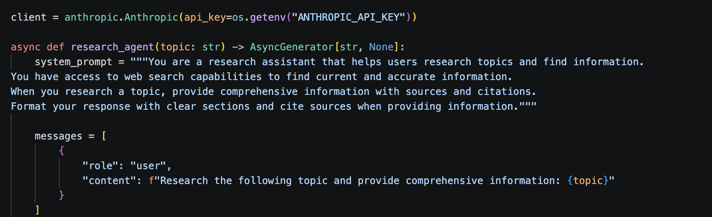

## Preview




## Prerequisites

- Python 3.9+
- Node.js 18+
- An Anthropic API key → https://console.anthropic.com

## Setup & Installation

### 1. Clone the repository

```bash
git clone https://github.com/oskitar3000/research-agent.git
cd research-agent
```

### 2. Set up the backend

```bash
cd backend

python3 -m venv venv
source venv/bin/activate        # Windows: venv\Scripts\activate

pip install -r requirements.txt

echo "ANTHROPIC_API_KEY=your-key-here" > .env
```

### 3. Set up the frontend

```bash
cd ../frontend
npm install
```

## Running the App

**Terminal 1 — Backend:**
```bash
cd backend
source venv/bin/activate
python main.py
```
Backend runs at `http://localhost:8000`

**Terminal 2 — Frontend:**
```bash
cd frontend
npm run dev
```
Frontend runs at `http://localhost:5173`

## Usage

1. Open `http://localhost:5173` in your browser
2. Click a suggested topic or type your own
3. Hit **Research** and watch results stream in real time
4. Past searches are saved — click any to re-run it

## API Reference

### `POST /api/research`

Streams research results for a given topic using Server-Sent Events.

**Request:**
```json
{ "topic": "computer vision in sports" }
```

**Response (SSE stream):**
```json
{ "type": "content", "content": "streamed text..." }
{ "type": "done", "content": "" }
{ "type": "error", "content": "error message" }
```

### `GET /health`
```json
{ "status": "ok" }
```

## Building for Production

**Frontend:**
```bash
cd frontend
npm run build
# Output in frontend/dist/
```

**Backend:** Deploy the `backend/` folder in any Python environment with dependencies installed.

## Roadmap

- [x] Real-time streaming responses
- [x] Markdown rendering
- [x] Topic suggestions
- [x] Search history
- [ ] Export results as PDF
- [ ] Multi-model support (GPT-4, Gemini)
- [ ] Save and share research sessions

## Author

Oscar Monterde — [github.com/oskitar3000](https://github.com/oskitar3000)

---

Built as part of an AI portfolio project.